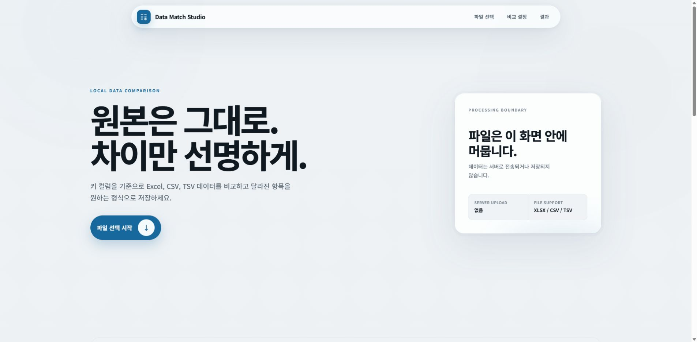

# Data Match Studio

Excel, CSV, TSV 파일을 키 기준으로 비교하는 데이터 비교 앱입니다. 파일명, 시트명, 컬럼명을 하드코딩하지 않으며, 배포된 웹 앱에서 선택한 파일은 서버로 전송하거나 저장하지 않고 브라우저 안에서만 처리합니다.

## 바로 사용하기

**[Data Match Studio 실행](https://data-match-studio.vercel.app)**

1. 비교할 두 파일과 워크시트를 선택합니다.
2. 양쪽 파일에서 대응되는 키 컬럼을 같은 순서로 선택합니다.
3. 필요하면 `키 이름 통합 사용`을 켜고 Wide 형식 XLSX·CSV 또는 JSON을 불러옵니다.
4. 매핑 파일의 시트·헤더 행·대표값 컬럼·별칭 컬럼과 적용할 키 컬럼을 선택합니다.
5. 비교할 컬럼, 데이터 유형, 빈 값 처리, 영문 대소문자 구분, 중복 키 비교 기준을 설정합니다.
6. 비교를 실행하고 원본·정규화·표준 키를 확인하거나 CSV, JSON, XLSX로 내려받습니다.

## 화면 미리보기

### 메인 화면

두 파일을 브라우저 안에서 안전하게 비교하고 결과를 내려받을 수 있습니다.

<p align="center">
  
</p>

## 주요 기능

- XLSX, CSV, TSV 파일 비교
- 같은 Excel 파일의 서로 다른 워크시트 비교
- 단일 키와 복합 키 지원
- 선택 순서 기반 복수 키·비교 컬럼 매칭
- 선택적인 키 이름 통합으로 서로 다른 키 명칭을 표준 키로 통합
- 임의 헤더 Wide XLSX·CSV, 직접 입력, JSON 저장·불러오기 지원
- 복합 키에서 지정한 키 컬럼에만 매핑 적용
- 정규화 후 별칭 충돌·대표값/별칭 체인 충돌 차단
- 중복 키의 고유값·전체값·집계값·대표 행 비교
- 문자·숫자·날짜·불리언 데이터 비교와 빈 값 처리
- 규칙별 첫 번째·두 번째 파일의 원본 비교값 표시
- 형식 변환에 실패한 규칙과 원본값 확인
- 키 검색, 상태별 결과 필터, 빈 키 행 분리
- 비교 결과 CSV, JSON, XLSX 다운로드
- 비교 설정 템플릿 저장 및 불러오기
- N:M 카테시안 곱 차단 및 명시적인 중복 처리

## 컬럼 선택 순서

키 컬럼과 비교 컬럼은 복수 선택할 수 있습니다. 양쪽에서 **선택한 순서대로 1:1 매칭**되며, 양쪽의 선택 개수가 같아야 비교를 실행할 수 있습니다.

예를 들어 다음 두 파일을 비교한다고 가정합니다.

| 첫 번째 파일 | 두 번째 파일 |
|---|---|
| 상품코드 | 제품번호 |
| 상품명 | 제품명 |
| 판매수량 | 주문수량 |

올바른 선택 순서는 다음과 같습니다.

1. `상품코드` ↔ `제품번호`
2. `상품명` ↔ `제품명`
3. `판매수량` ↔ `주문수량`

다음처럼 선택하면 서로 다른 의미의 컬럼끼리 비교됩니다.

1. `상품코드` ↔ `제품번호`
2. `상품명` ↔ `주문수량`
3. `판매수량` ↔ `제품명`

컬럼 이름이 비슷해도 자동으로 연결되지 않습니다. 실행 전에 선택된 컬럼의 번호와 결과의 규칙별 대응 관계를 확인하세요.

## 키 이름 통합

키 이름 통합은 기본적으로 꺼져 있습니다. 같은 대상을 파일마다 다른 명칭으로 기록한 경우에만 비교 설정의 **키 이름 통합 사용**을 켭니다. 매핑 파일도 비교 파일과 마찬가지로 브라우저 내부에서만 읽으며 서버로 업로드하거나 영구 저장하지 않습니다. 사전은 하나만 만들며, 이 하나의 사전을 A·B 양쪽 파일에서 선택한 키 컬럼에 공통으로 적용합니다. 컬럼 이름이 파일마다 달라 적용 대상만 양쪽에서 각각 선택합니다.

### 매핑 파일

XLSX 또는 UTF-8 CSV의 한 행이 하나의 대표값 그룹입니다. 헤더명은 자유롭고 별칭 열 수에는 제한이 없습니다.

| 업체 | 다른이름 | 구명칭 | 약칭 |
|---|---|---|---|
| DUNS | 빨강 | 파랑 | 초록 |
| 고구마 | 수박 | 파도 | 비행 |

1. 매핑 파일과 Excel 시트를 선택합니다.
2. 실제 헤더가 있는 행을 선택합니다.
3. `업체`처럼 대표값이 들어 있는 컬럼 한 개를 직접 선택합니다.
4. 별칭 컬럼을 여러 개 선택하거나 **대표값 컬럼을 제외한 나머지 컬럼을 모두 별칭으로 사용**을 켭니다.
5. 복합 키를 사용한다면 첫 번째·두 번째 파일에서 매핑을 적용할 키 컬럼만 체크합니다.

빈 별칭 셀은 무시합니다. 대표값 자체도 자기 자신으로 등록합니다. 사전에 없는 값은 오류가 아니며 기존 정규화 값 그대로 비교합니다.

### 직접 등록과 JSON 재사용

소규모 사전은 화면에서 **그룹 추가** 후 대표값과 쉼표로 구분한 별칭을 입력합니다. 그룹은 수정·삭제할 수 있습니다. 현재 사전은 다음 구조의 JSON으로 저장하고 다시 불러올 수 있습니다.

```json
{
  "DUNS": ["빨강", "파랑", "초록"],
  "고구마": ["수박", "파도", "비행"]
}
```

비교 설정 템플릿에도 매핑 사용 여부, 그룹, 적용 키 컬럼, 키 대소문자 설정이 포함됩니다. 원본 매핑 파일 바이트는 템플릿에 포함하지 않습니다.

### 처리 순서와 충돌

처리 순서는 `원본 키 → 빈값 처리 → 문자열 변환 및 키 정규화 → alias → canonical 매핑 → 복합 표준 키 → 중복·카디널리티 분석 → 비교`입니다. 결과와 다운로드에는 A/B 원본 키, 정규화 키, 표준 키, 매핑 적용 여부가 포함됩니다.

다음 오류가 있으면 비교 실행 버튼이 비활성화됩니다.

- 하나의 정규화된 별칭이 둘 이상의 대표값에 연결됨
- 대표값이 다른 그룹의 별칭으로 사용됨
- `A → B → C` 형태의 체인 매핑
- 대소문자 무시나 공백 정리 후 새로 발생한 충돌

같은 별칭의 동일 대표값 반복, 빈 별칭 셀, 완전히 중복된 행, 별칭 없는 대표값은 경고로 표시합니다. 매핑으로 여러 원본 키가 하나의 표준 키가 되면 표준 키를 기준으로 1:N, N:1, N:M을 다시 계산하고 기존 중복 정책을 그대로 적용합니다. N:M은 자동 카테시안 곱을 만들지 않습니다.

## 데이터 유형과 형식 변환

각 비교 규칙에서 문자, 숫자·금액·수량, 날짜·시간, 참·거짓 유형을 선택할 수 있습니다. 브라우저 앱의 숫자 비교는 쉼표와 공백을 제외한 순수 숫자 형식을 처리합니다.

| 원본 값 | 숫자 변환 결과 |
|---|---|
| `1250` | 변환 가능 |
| `1,250` | 변환 가능 |
| `1,250개` | 형식 변환 실패 |
| `배송완료` | 형식 변환 실패 |

단위가 포함된 값이나 상태·분류 값은 `문자` 유형으로 비교하거나, 원본 데이터에서 숫자와 단위를 별도 컬럼으로 분리하세요. 형식 변환에 실패하면 결과 화면에서 실패한 비교 규칙과 양쪽 원본값을 확인할 수 있습니다.

## 중복 키 비교 기준

같은 키가 한쪽 또는 양쪽 파일에 여러 번 나타날 때 적용됩니다.

- **중복만 확인**: 중복 키의 존재만 표시하고 값 비교는 수행하지 않습니다.
- **고유값 기준(중복 횟수 제외)**: 값의 종류만 비교하고 등장 횟수는 무시합니다.
- **전체값 기준(중복 횟수 포함)**: 값의 종류와 각 값의 등장 횟수를 모두 비교합니다.
- **집계값 기준**: 합계, 평균, 최솟값, 최댓값, 개수 등의 집계 결과를 비교합니다.
- **대표 행 기준**: 고급 설정의 기준 컬럼으로 대표 행을 선택한 뒤 비교합니다.

고유값 기준과 전체값 기준의 차이는 다음과 같습니다.

| 첫 번째 파일 | 두 번째 파일 | 고유값 기준 | 전체값 기준 |
|---|---|---|---|
| 사과, 사과, 배 | 사과, 배 | 동일 | 불일치 |
| 사과, 사과, 배 | 배, 사과, 사과 | 동일 | 동일 |

전체값 기준은 행의 순서를 무시하지만 값별 등장 횟수는 유지합니다.

> 여러 비교 컬럼을 선택하면 현재 구현은 각 비교 규칙의 값 분포를 독립적으로 비교합니다. 같은 행에 있는 여러 컬럼의 조합 전체를 하나의 묶음으로 비교하는 방식은 아닙니다.

## 결과 확인

결과 화면에서는 다음 항목을 확인할 수 있습니다.

- 전체 Lane, 일치, 불일치, 한쪽 파일에만 존재하는 키, 빈 키 행 요약
- 각 비교 규칙의 컬럼 연결과 양쪽 원본값
- 형식 변환 실패 규칙
- 중복 키의 양쪽 데이터 건수
- 키 검색과 상태별 필터
- CSV, JSON, XLSX 결과 다운로드

빈 키 행은 유효한 Lane 비교와 일치율 계산에서 제외하고 별도 영역에 표시합니다.

## 브라우저 앱과 로컬 Streamlit

| 항목 | 배포된 브라우저 앱 | 로컬 Streamlit |
|---|---|---|
| XLSX, CSV, TSV | 지원 | 지원 |
| XLSM | 미지원 | 제한적으로 지원 |
| CP949, EUC-KR CSV | 미지원 | 지원 |
| 파일 처리 위치 | 브라우저 내부 | 사용자 PC의 로컬 Python 환경 |
| 키 매핑 Wide XLSX·CSV / 직접 입력 / JSON | 지원 | 지원 |
| 설치 | 불필요 | Python 및 의존성 설치 필요 |

여러 워크시트를 비교하려면 같은 파일을 양쪽에 선택한 뒤 각각 다른 워크시트를 지정하면 됩니다.

### 브라우저 앱 사용 시 참고

- CSV와 TSV는 UTF-8 또는 UTF-8 BOM 인코딩을 사용해야 합니다.
- XLSX 수식은 실행하지 않고 파일에 저장된 캐시 결과값을 읽습니다. 캐시값이 없으면 빈 값으로 처리될 수 있습니다.
- 매크로가 포함된 XLSM, 암호화 파일, 손상된 파일, ZIP64 파일은 브라우저 앱에서 거부합니다.
- 브라우저 안전 한도는 CSV 64MB, XLSX 입력 128MB·압축 데이터 합계 64MB, 워크시트 최대 512컬럼·500만 셀입니다.
- 실제 처리 가능 크기는 사용 중인 브라우저와 기기의 메모리에 따라 더 작을 수 있습니다.

## 브라우저 앱 로컬 개발

Node.js 20 이상이 필요합니다.

```bash
npm ci
npm run dev
```

개발 서버를 실행한 뒤 `http://localhost:3000`을 엽니다. 별도의 API 서버나 데이터베이스는 필요하지 않습니다.

## 로컬 Streamlit 실행

Python 3.11 이상이 필요합니다.

```bash
python -m venv .venv

# Windows PowerShell
.\.venv\Scripts\Activate.ps1

python -m pip install -r requirements.txt
streamlit run app.py
```

브라우저에서 `http://localhost:8501`을 엽니다. XLSM이나 비 UTF-8 CSV처럼 브라우저 앱에서 제한되는 파일이 필요할 때 사용할 수 있습니다.

## 검증

```bash
python -m pytest -q
npm test
npm run typecheck
npm run static-export
```

- `python -m pytest -q`: Streamlit 경로와 Python 비교 엔진 테스트
- `npm test`: 브라우저 파일 파서와 비교 엔진 테스트
- `npm run typecheck`: TypeScript 타입 검사
- `npm run static-export`: 프로덕션 빌드와 정적 클라이언트 경계 검사

## 프로젝트 구조

- `app/`: Next.js 화면, 공통 스타일, 클라이언트 비교 흐름
- `app/components/`: 업로드, 키 매핑, 비교 설정, 결과 UI 컴포넌트
- `web/src/mapping/`: 브라우저 키 매핑 파싱·검증·적용 모듈
- `web/`: 브라우저 파일 파싱, 비교 엔진, 내보내기, 테스트
- `scripts/`: 정적 배포 경계 검증 스크립트
- `app.py`, `src/`: Streamlit 화면과 Python 비교 엔진
- `src/mapping/`: Python/Streamlit 키 매핑 파싱·검증·적용 모듈
- `tests/`: Python 경로 테스트

## 배포

프로덕션은 Vercel에 정적 Next.js 애플리케이션으로 배포합니다. `main` 브랜치에 푸시하면 연결된 Vercel 프로젝트에서 자동으로 배포합니다.

필요한 경우 다음 명령으로 수동 배포할 수 있습니다.

```bash
npx vercel@latest --prod
```

## Docker

Docker 실행 경로는 Streamlit 앱을 제공합니다.

```bash
docker build -t data-match-studio .
docker run --rm -p 8501:8501 data-match-studio
```

브라우저에서 `http://localhost:8501`을 엽니다.

## 개인정보 및 배포 구조

Vercel 앱은 정적 Next.js 애플리케이션입니다. API Route, Server Action, 파일 업로드 서버, 데이터베이스를 사용하지 않습니다. 선택한 파일은 `File`과 `ArrayBuffer`로 브라우저 안에서만 처리됩니다.
